# Project Architecture Documentation

## Table of Contents
1. [Introduction](#introduction)
2. [System Overview](#system-overview)
3. [Component Details](#component-details)
   - 3.1 [Data Layer](#data-layer)
   - 3.2 [Aggregation Layer](#aggregation-layer)
   - 3.3 [LLM Layer](#llm-layer)
4. [Key Interactions](#key-interactions)
5. [Conclusion](#conclusion)

## 1. Introduction

This document provides an overview of the architecture for a vulnerability management system. The system is designed to process, analyze, and aggregate vulnerability findings, utilizing advanced natural language processing techniques and machine learning models to enhance the analysis and reporting of security vulnerabilities.

## 2. System Overview

The system is composed of three main layers:

1. Data Layer: Manages the core data structures and objects.
2. Aggregation Layer: Handles the processing and grouping of findings.
3. LLM (Language Model) Layer: Provides natural language processing capabilities.

Here's a high-level overview of the system:

## 3. Component Details

### 3.1 Data Layer

The Data Layer is responsible for managing the core data structures used throughout the system.

Key components:

- **VulnerabilityReport**: The central class that holds all findings and aggregated solutions. It provides methods for adding findings, managing categories, and exporting/importing data.

- **Finding**: Represents an individual vulnerability finding, containing details such as title, description, severity, and associated solution.

- **Solution**: Holds information about the recommended fix for a vulnerability, including short and long descriptions and search terms.

- **AggregatedSolution**: Represents a solution that addresses multiple related findings.

- **Category**: Used to classify findings based on various attributes such as technology stack, security aspect, and severity level.

### 3.2 Aggregation Layer

The Aggregation Layer is responsible for processing and grouping findings to generate more comprehensive and actionable insights.

Key components:

- **FindingBatcher**: Responsible for creating batches of related findings for efficient processing.

- **FindingGrouper**: Uses the FindingBatcher to create groups of related findings and generate aggregated solutions.

- **AgglomerativeClusterer**: Implements unsupervised clustering of findings using sentence embeddings, allowing for the discovery of patterns and relationships between vulnerabilities.

### 3.3 LLM Layer

The LLM (Language Model) Layer provides natural language processing capabilities to enhance the analysis and generation of vulnerability-related content.

Key components:

- **BaseLLMService**: An abstract base class that defines the interface for language model services.

- **LLMServiceMixin**: Provides common utility methods for LLM services, such as API key management and response parsing.

- **LLMServiceStrategy**: Implements the strategy pattern, allowing for easy switching between different LLM services.

- **OLLAMAService** and **OpenAIService**: Concrete implementations of the BaseLLMService for specific LLM providers.

## 4. Key Interactions

1. **Finding Creation and Categorization**:
   - The `VulnerabilityReport` class adds new `Finding` objects.
   - The `AgglomerativeClusterer` is used to add unsupervised categories to the findings.

2. **Solution Generation**:
   - Individual `Finding` objects generate solutions using the LLM service.
   - The `FindingGrouper` uses the `FindingBatcher` to create groups of related findings.
   - The `FindingGrouper` then generates `AggregatedSolution` objects for these groups using the LLM service.

3. **LLM Service Usage**:
   - The `LLMServiceStrategy` is used throughout the system to interact with the chosen LLM service (either OLLAMA or OpenAI).
   - LLM services are used for tasks such as combining descriptions, classifying findings, generating recommendations, and creating aggregated solutions.

4. **Report Generation**:
   - The `VulnerabilityReport` class provides methods to export the findings and aggregated solutions in various formats (e.g., JSON, HTML).

## 5. Conclusion

This architecture provides a flexible and scalable approach to vulnerability management. By separating concerns into distinct layers and utilizing advanced NLP techniques, the system can efficiently process, analyze, and aggregate vulnerability findings. The use of strategy patterns and abstract base classes allows for easy extension and modification of key components, such as adding new LLM services or implementing additional clustering algorithms.
