# Data Schema

This document provides a detailed description of the data formats used by the Security Findings Recommender System.



## VulnerabilityReport Object

The `VulnerabilityReport` object represents the entire vulnerability report.

### Structure

```json
{
  "findings": [
    {
      "title": ["List of titles",]
      "source": "Set of sources",
      "description": "Description, may be generated from multiple sources",
      "descriptions": ["List of descriptions",]
      "location_list": ["List of locations",]
      "cwe_ids": ["List of CWE IDs",]
      "cve_ids": ["List of CVE IDs",]
      "severity": "Severity level (integer)",
      "priority": "Priority level (integer)",
      "category": "Category (optional)",
      "solution": "Solution object (optional)"
    }
  ]
}
```

## Finding Object
The `Finding object` represents a single security finding.

### Structure

```json
{
  "title": ["List of titles"],
  "source": "Set of sources",
  "description": "Description, may be generated from multiple sources",
  "descriptions": ["List of descriptions"],
  "cwe_ids": ["List of CWE IDs"],
  "cve_ids": ["List of CVE IDs"],
  "severity": "Severity level (integer)",
  "priority": "Priority level (integer)",
  "category": "Category (optional)",
  "solution": "Solution object (optional)"
}
```

### Fields
- title: A list of titles for the finding.
- source: A set of sources where the finding was identified.
- description: A description of the finding. If the list of description only has one element, this will be this element. Otherwise, this will be a summarized concatenation of all descriptions.
- descriptions: A list of descriptions providing details about the finding.
- cwe_ids: A list of Common Weakness Enumeration (CWE) IDs associated with the finding.
- cve_ids: A list of Common Vulnerabilities and Exposures (CVE) IDs associated with the finding.
- severity: An integer representing the severity level of the finding.
- priority: An integer representing the priority level of the finding.
- category: A string representing the category of the finding (optional).
- solution: A Solution object providing details for addressing the finding (optional).

## Solution Object
The Solution object represents a solution for a security finding.

### Structure

```json
{
  "short_description": "Short description of the solution",
  "long_description": "Detailed description of the solution",
  "search_terms": ["List of search terms"]
}
```

### Fields
- short_description: A brief description of the solution.
- long_description: A detailed description of the solution.
- search_terms: A list of search terms associated with the solution.

## AggregatedSolution Object
The AggregatedSolution object represents a solution that has been aggregated for multiple findings.

### Structure
```json
{
  "findings": [
    "List of Finding objects"
  ],
  "solution": "Aggregated solution description",
  "metadata": "Dictionary of additional metadata"
}
```

### Fields

- findings: A list of `Finding` objects that the solution addresses.
- solution: A description of the aggregated solution.
- metadata: A dictionary containing additional metadata about the aggregated solution.

# Categories.py Documentation

## Categories
The Categories module defines a set of enumerations and a Category class for classifying security-related issues and solutions in software development and deployment. It provides a structured way to categorize various aspects of security concerns, including technology stacks, security aspects, severity levels, remediation types, affected components, compliance standards, and deployment environments. This class can easily be extended to include additional categories as needed.

### Enum Classes

#### TechnologyStack

| Enum Value | String Value |
|------------|--------------|
| JAVASCRIPT | "JavaScript" |
| PYTHON     | "Python"     |
| JAVA       | "Java"       |
| DOTNET     | "DotNet"     |
| SQL        | "SQL"        |
| NOSQL      | "NoSQL"      |
| CLOUD      | "Cloud"      |
| RUST       | "Rust"       |
| GO         | "Go"         |
| C_DIALECT  | "CDialect"   |
| RUBY       | "Ruby"       |
| PHP        | "PHP"        |
| ON_PREMISE | "OnPremise"  |

#### SecurityAspect

| Enum Value        | String Value        |
|-------------------|----------------------|
| AUTHENTICATION    | "Authentication"     |
| AUTHORIZATION     | "Authorization"      |
| DATA_ENCRYPTION   | "DataEncryption"     |
| INPUT_VALIDATION  | "InputValidation"    |
| XSS               | "CrossSiteScripting" |
| SQL_INJECTION     | "SQLInjection"       |
| CommandInjection  | "CommandInjection"   |
| CRYPTOGRAPHY      | "Cryptography"       |
| LOGGING           | "Logging"            |
| CONFIGURATION     | "Configuration"      |

#### SeverityLevel

| Enum Value     | String Value    |
|----------------|-----------------|
| CRITICAL       | "Critical"      |
| HIGH           | "High"          |
| MEDIUM         | "Medium"        |
| LOW            | "Low"           |
| INFORMATIONAL  | "Informational" |

#### RemediationType

| Enum Value           | String Value          |
|----------------------|------------------------|
| CODE_FIX             | "CodeFix"              |
| CONFIGURATION_CHANGE | "ConfigurationChange"  |
| DEPENDENCY_UPDATE    | "DependencyUpdate"     |
| ARCHITECTURE_CHANGE  | "ArchitectureChange"   |
| SECURITY_TRAINING    | "SecurityTraining"     |
| PROCESS_IMPROVEMENT  | "ProcessImprovement"   |

#### AffectedComponent

| Enum Value              | String Value            |
|-------------------------|--------------------------|
| USER_INTERFACE          | "UserInterface"          |
| API                     | "API"                    |
| DATABASE                | "Database"               |
| NETWORK                 | "Network"                |
| THIRD_PARTY_INTEGRATION | "ThirdPartyIntegration"  |
| AUTHENTICATION_SERVICE  | "AuthenticationService"  |
| LOGGING_SYSTEM          | "LoggingSystem"          |
| CACHING_LAYER           | "CachingLayer"           |
| ORCHESTRATION           | "Orchestration"          |

#### Compliance

| Enum Value | String Value |
|------------|--------------|
| GDPR       | "GDPR"       |
| PCI_DSS    | "PCI_DSS"    |
| HIPAA      | "HIPAA"      |
| ISO27001   | "ISO27001"   |
| SOC2       | "SOC2"       |
| NIST       | "NIST"       |

#### Environment

| Enum Value      | String Value    |
|-----------------|-----------------|
| DOCKER          | "Docker"        |
| KUBERNETES      | "Kubernetes"    |
| SERVERLESS      | "Serverless"    |
| VIRTUAL_MACHINE | "VirtualMachine"|
| BARE_METAL      | "BareMetal"     |

## Data Conversion Methods

### to_dict() Methods

- **VulnerabilityReport.to_dict()**  
  Returns a list of dictionaries, where each dictionary represents a `Finding` object.

- **Finding.to_dict()**  
  Returns a dictionary representing the `Finding` object.

- **Solution.to_dict()**  
  Returns a dictionary representing the `Solution` object.

- **AggregatedSolution.to_dict()**  
  Returns a dictionary representing the `AggregatedSolution` object.

# Example Data Structures

### VulnerabilityReport Example:

```json
{
  "findings": [
    {
      "title": ["Example Finding"],
      "source": ["Source 1", "Source 2"],
      "description": ["This is an example finding."],
      "location_list": ["Location 1", "Location 2"],
      "cwe_ids": ["CWE-79"],
      "cve_ids": ["CVE-2021-12345"],
      "severity": 5,
      "priority": 1,
      "category": "CODE",
      "solution": {
        "short_description": "Example Solution",
        "long_description": "This is a detailed description of the example solution.",
        "search_terms": ["example", "solution"]
      }
    }
  ]
}
```

### Finding Example:
```json
{
  "title": ["Example Finding"],
  "source": ["Source 1", "Source 2"],
  "description": ["This is an example finding."],
  "cwe_ids": ["CWE-79"],
  "cve_ids": ["CVE-2021-12345"],
  "severity": 5,
  "priority": 1,
  "category": "CODE",
  "solution": {
    "short_description": "Example Solution",
    "long_description": "This is a detailed description of the example solution.",
    "search_terms": ["example", "solution"]
  }
}
```

### Solution Example
```json
{
  "short_description": "Example Solution",
  "long_description": "This is a detailed description of the example solution.",
  "search_terms": ["example", "solution"]
}
```

### AggregatedSolution Example
```json
{
  "findings": [
    {
      "title": ["Example Finding 1"],
      "source": ["Source 1"],
      "description": ["This is an example finding 1."],
      "cwe_ids": ["CWE-79"],
      "cve_ids": ["CVE-2021-12345"],
      "severity": 5,
      "priority": 1,
      "category": "CODE",
      "solution": {
        "short_description": "Example Solution 1",
        "long_description": "This is a detailed description of the example solution 1.",
        "search_terms": ["example", "solution"]
      }
    },
    {
      "title": ["Example Finding 2"],
      "source": ["Source 2"],
      "description": ["This is an example finding 2."],
      "cwe_ids": ["CWE-89"],
      "cve_ids": ["CVE-2021-67890"],
      "severity": 3,
      "priority": 2,
      "category": "USER",
      "solution": {
        "short_description": "Example Solution 2",
        "long_description": "This is a detailed description of the example solution 2.",
        "search_terms": ["example", "solution"]
      }
    }
  ],
  "solution": "Aggregated solution for multiple findings.",
  "metadata": {
    "aggregation_method": "example method"
  }
}
```

### str() Methods
All data classes have a `__str__` method that returns a string representation of the object. This method is useful for debugging and logging purposes and is used to get a class representation for the LLMs.

### to_html() Methods
All main data classes have a `to_html()` method that returns an HTML representation of the object. This method is useful for generating HTML reports and visualizations of the data. VulnerabilityReport and Findings accept the param `table: boolean` to return the data in a table format.